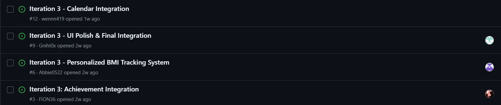

# Sprint Backlog

## Introduction

The Sprint Backlog contains the development tasks selected from the Product Backlog for implementation during each sprint. It provides a detailed breakdown of the work required to achieve the sprint goal and serves as the team's reference throughout the sprint.

Each backlog item was assigned to the responsible team member based on their Scrum role and development responsibility. The Sprint Backlog also allowed the team to monitor task progress, coordinate development activities, and ensure that all planned work was completed before the Sprint Review.

---

# Sprint 1 Backlog

## Selected User Stories

The following user stories were selected from the Product Backlog for Sprint 1.

| ID | User Story | Priority | Story Points |
|----|------------|----------|-------------:|
| US-01 | As a user, I want to calculate my BMI so that I can understand my current health status. | High | 5 |
| US-02 | As a user, I want to schedule workouts using a calendar so that I can organise my exercise plan effectively. | High | 5 |
| US-03 | As a user, I want to earn achievement badges so that I stay motivated to complete my workouts. | High | 3 |

**Total Story Points:** **13**

---

## Sprint Task Breakdown

| Issue | Development Task | Assignee | Estimated Hours | Status |
|------|-------------------|----------|----------------:|--------|
| #1 | Basic Achievement Badge System| Fion Yap Qian Wen | 3h | Completed |
| #4 | Basic BMI Assessment System | Abbie Song | 2h | Completed |
| #7 | UI/UX Design & Front-End Integration | Goh Tse Thing | 2h | Completed |
| #10 | Basic Calendar | Cheng Shu Wen | 3h | Completed |

---

## Workload Summary

| Team Member | Assigned Tasks | Estimated Hours |
|-------------|----------------|----------------:|
| Abbie Song | Basic BMI Assessment System | 2h |
| Goh Tse Thing | UI/UX Design & Front-End Integration | 2h |
| Cheng Shu Wen | Basic Calendar | 3h |
| Fion Yap Qian Wen | Basic Achievement Badge System | 3h |

**Total Estimated Development Time:** **10 Hours**

---

## Definition of Done

Sprint 1 backlog items were considered complete when:

- All assigned development tasks were completed.
- Source code was committed and merged into the project repository.
- Features functioned correctly during testing.
- No critical defects remained unresolved.
- The implemented features were ready for Sprint Review.

---

## Sprint Summary

Sprint 1 established the core functionality of the Fitness Workout Tracker by successfully implementing the basic Calendar Feature, BMI Calculator, and Achievement Badge System. The completion of these backlog items provided a stable foundation for the feature enhancements planned in Sprint 2.

---

## Evidence

### Evidence 1: Sprint 1 GitHub Backlog

The following screenshots show the GitHub Issues created for Sprint 1. These issues represent the development tasks assigned to each team member and were tracked throughout the sprint implementation.

.png)
.png)
.png)
.png)

*Figure 1. GitHub Issues for Sprint 1 showing the assigned development tasks and their completion status.*

---

# Sprint 2 Backlog

## Selected User Stories

The following user stories were selected from the Product Backlog for Sprint 2.

| ID | User Story | Priority | Story Points |
|----|------------|----------|-------------:|
| US-04 | As a user, I want to save my BMI history so that I can monitor my fitness progress over time. | High | 5 |
| US-05 | As a user, I want exercise recommendations based on my BMI so that I can follow a suitable workout plan. | High | 5 |
| US-06 | As a user, I want to track badge progress so that I know how close I am to unlocking achievements. | High | 3 |

**Total Story Points:** **13**

---

## Sprint Task Breakdown

| Issue | Development Task | Assignee | Estimated Hours | Status |
|------|-------------------|----------|----------------:|--------|
| #2 | Achievement Enhancement | Fion Yap Qian Wen | 4h | Completed |
| #5 | Enhanced BMI Recommendation System | Abbie Song | 3h | Completed |
| #8 | UI Enhancement & Responsive Improvements | Goh Tse Thing | 2h | Completed |
| #11 | Calendar Enhancement | Cheng Shu Wen | 4h | Completed |

---

## Workload Summary

| Team Member | Assigned Tasks | Estimated Hours |
|-------------|----------------|----------------:|
| Abbie Song | BMI Enhancement | 3h |
| Goh Tse Thing | UI Enhancement & Front-End Improvements | 2h |
| Cheng Shu Wen | Calendar Enhancement | 4h |
| Fion Yap Qian Wen | Achievement Enhancement | 4h |

**Total Estimated Development Time:** **13 Hours**

---

## Definition of Done

Sprint 2 backlog items were considered complete when:

- All assigned enhancement tasks were completed.
- New functionality was successfully integrated with the existing system.
- Functional and integration testing were completed successfully.
- No major defects remained unresolved.
- The enhanced features were ready for Sprint Review.

---

## Sprint Summary

Sprint 2 focused on enhancing the functionality developed during Sprint 1. Improvements were made to the Calendar Feature, BMI Recommendation System, Achievement Badge System, and user interface. These enhancements improved usability, functionality, and overall user experience while preparing the application for full system integration in Sprint 3.

---

## Evidence

### Evidence 2: Sprint 2 GitHub Backlog

The following screenshots show the GitHub Issues created for Sprint 2. These issues represent the enhancement tasks assigned to each team member and were tracked throughout the sprint implementation.

.png)

.png)

.png)

.png)

*Figure 2. GitHub Issues for Sprint 2 showing the assigned enhancement tasks and their completion status.*

---

# Sprint 3 Backlog

## Selected User Stories

The following user stories were selected from the Product Backlog for Sprint 3.

| ID | User Story | Priority | Story Points |
|----|------------|----------|-------------:|
| US-07 | As a user, I want to set a target BMI so that I can achieve my fitness goals. | High | 5 |
| US-08 | As a user, I want to monitor my progress toward my target BMI so that I remain motivated. | High | 5 |
| US-09 | As a user, I want advanced achievement badges so that I am rewarded for long-term commitment. | High | 3 |

**Total Story Points:** **13**

---

## Sprint Task Breakdown

| Issue | Development Task | Assignee | Estimated Hours | Status |
|------|-------------------|----------|----------------:|--------|
| #3 | Achievement Integration | Fion Yap Qian Wen | 4h | Completed |
| #6 | Personalized BMI Tracking System | Abbie Song | 4h | Completed |
| #9 | UI Polish & Final Integration | Goh Tse Thing | 4h | Completed |
| #12 | Calendar Integration | Cheng Shu Wen | 4h | Completed |

---

## Workload Summary

| Team Member | Assigned Tasks | Estimated Hours |
|-------------|----------------|----------------:|
| Abbie Song | BMI Integration | 4h |
| Goh Tse Thing | UI Polish & Final Integration | 4h |
| Cheng Shu Wen | Calendar Integration | 4h |
| Fion Yap Qian Wen | Achievement Integration | 4h |

**Total Estimated Development Time:** **16 Hours**

---

## Definition of Done

Sprint 3 backlog items were considered complete when:

- All assigned integration tasks were completed.
- All project modules were successfully integrated into a single application.
- Functional, integration, and final system testing were completed successfully.
- No critical defects remained unresolved.
- The application was ready for final demonstration and project submission.

---

## Sprint Summary

Sprint 3 focused on integrating all major project components into a complete Fitness Workout Tracker application. The Calendar Feature, BMI Tracking System, Achievement Badge System, and user interface were successfully integrated to provide a seamless and personalised user experience. The completion of Sprint 3 marked the successful delivery of the final working product.

---

## Evidence

### Evidence 3: Sprint 3 GitHub Backlog

The following screenshots show the GitHub Issues created for Sprint 3. These issues represent the final integration tasks assigned to each team member and were tracked until project completion.

*Figure 3. GitHub Issues for Sprint 3 showing the assigned integration tasks and their completion status.*

---

# Conclusion

The Sprint Backlog served as the primary working document throughout the development of the Fitness Workout Tracker project by translating product requirements into manageable development tasks for each sprint. Each backlog item was assigned according to the responsibilities of individual team members and was tracked using GitHub Issues to ensure transparency and accountability during development.

Across the three sprints, the team successfully completed all planned backlog items, progressively implementing the core features, enhancing system functionality, and finally integrating all modules into a complete application. The Sprint Backlog facilitated effective task management, improved collaboration among team members, and supported the successful delivery of the project in accordance with Scrum Agile practices.

---