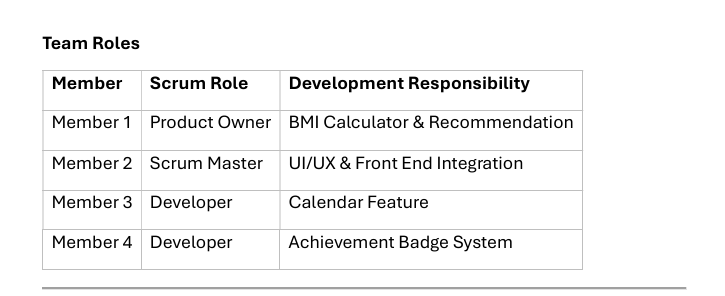

# Team Roles

## Introduction

The project adopted the **Scrum Agile methodology** to support **iterative and incremental software development** throughout the three project iterations. Scrum roles were assigned at the beginning of the project to establish clear responsibilities, improve collaboration, and ensure efficient sprint planning, development, integration, testing, and delivery.

The role assignment enabled the team to manage the product backlog effectively, coordinate development activities, and maintain accountability for each feature implemented in the Workout Tracker system.

---

## Team Structure

| Member Name           | Scrum Role        | Development Responsibility      |
| --------------------- | ----------------- | ------------------------------- |
| **Abbie Song**        | **Product Owner** | BMI Calculator & Recommendation |
| **Goh Tse Thing**     | **Scrum Master**  | UI/UX & Front-End Integration   |
| **Cheng Shu Wen**     | **Developer**     | Calendar Feature                |
| **Fion Yap Qian Wen** | **Developer**     | Achievement Badge System        |

---

## Role Responsibilities

### Product Owner

The Product Owner was responsible for managing the **product backlog**, prioritizing user stories, defining feature requirements, and ensuring that the **BMI Calculator and Recommendation** module fulfilled user needs and project objectives. The Product Owner also reviewed completed features during sprint reviews and provided feedback for subsequent iterations.

**Key responsibilities:**

* Manage and prioritize the product backlog
* Define user stories and acceptance criteria
* Clarify feature requirements for developers
* Validate completed features during sprint review
* Ensure alignment with project objectives

---

### Scrum Master

The Scrum Master facilitated Scrum activities, monitored sprint progress, coordinated communication among team members, and ensured that Agile principles were consistently followed throughout the project. The Scrum Master was also responsible for **UI/UX design, front-end integration, responsive design improvement, and interface consistency**.

**Key responsibilities:**

* Facilitate sprint planning meetings
* Conduct daily stand-up discussions
* Coordinate sprint reviews and retrospectives
* Remove development impediments when possible
* Monitor sprint progress and team collaboration
* Ensure adherence to Scrum practices
* Manage UI/UX consistency and front-end integration

---

### Developer – Calendar Feature

The developer was responsible for implementing the **Calendar module**, including workout scheduling, workout display, calendar navigation, filtering, and completed-workout indicators. The developer also participated in testing, debugging, and integration with the workout database.

**Key responsibilities:**

* Implement monthly and weekly calendar views
* Display scheduled workouts
* Enable date-based workout navigation
* Connect calendar data with the workout database
* Implement filtering and completed-workout indicators
* Participate in integration testing and debugging

---

### Developer – Achievement Badge System

The developer was responsible for developing the **Achievement Badge module**, including badge unlocking mechanisms, progress tracking, badge levels, and achievement display. The developer also integrated workout completion data with the badge system and participated in testing activities.

**Key responsibilities:**

* Create the achievement page
* Implement badge unlocking logic
* Display badge status and progress
* Add badge levels (Bronze, Silver, Gold)
* Integrate completed workouts with achievement tracking
* Participate in testing and integration activities

---

## Evidence

### Evidence 1: Project Team Roles

Figure 1 shows the Scrum team roles and responsibilities defined in the project planning document.

*Figure 1: Scrum team roles and assigned responsibilities.*

### Evidence 2: GitHub Collaboration

Figure 2 shows the GitHub repository used for collaborative development, including feature branches, issues, pull requests, and commit activities contributed by all team members.

*Figure 2: GitHub collaboration and version control activities.*

---

## Scrum Collaboration Process

The team collaborated throughout all three project iterations using Scrum practices. Sprint tasks were distributed according to each member’s role and technical expertise. The development process followed a consistent Agile workflow:

<List gap="2"><List.Item>**Sprint Planning** – Select user stories from the product backlog and assign sprint tasks.</List.Item><List.Item>**Daily Stand-up** – Share progress, planned work, and development blockers.</List.Item><List.Item>**Sprint Development** – Implement features using GitHub feature branches and collaborative coding practices.</List.Item><List.Item>**Sprint Review** – Demonstrate the working increment and gather feedback.</List.Item><List.Item>**Sprint Retrospective** – Reflect on challenges, collaboration, and process improvements for the next iteration.</List.Item></List>

Regular discussions were conducted to monitor progress, resolve technical issues, and ensure successful integration of the Calendar, BMI, and Achievement modules into a unified Workout Tracker system.

---

## GitHub Collaboration Practices

To support disciplined collaboration, the team used **GitHub** as the official project repository. The following practices were applied throughout the project:

* Feature branch development
* Issue tracking for sprint tasks
* Pull request submission and review
* Meaningful commit messages
* Project board task tracking
* Release tagging for each iteration
* Peer collaboration through review comments

These practices provided clear evidence of individual contributions and supported coordinated development across all iterations.

---

## Conclusion

Overall, assigning well-defined Scrum roles improved **task ownership, communication, accountability, and collaboration** throughout the project. The clear distribution of responsibilities enabled the team to execute sprint activities effectively, maintain organized workflow management, and deliver functional working increments across all three iterations.

The combination of Scrum role allocation, regular Agile ceremonies, and GitHub-based collaboration provided strong evidence of the team’s application of **iterative and incremental software development practices** in accordance with Software Engineering project requirements.
